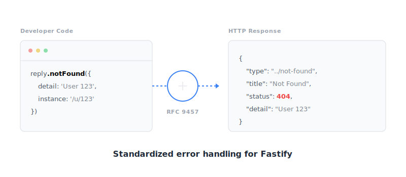
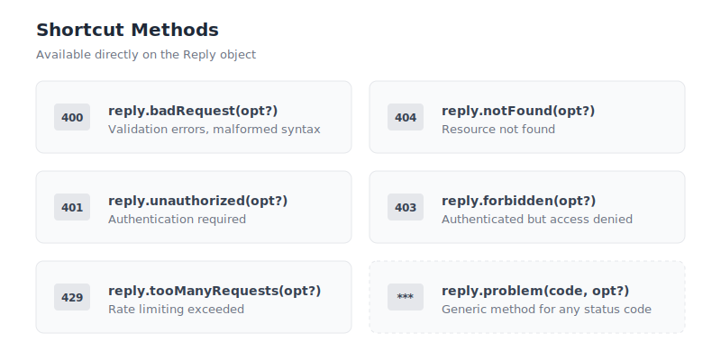

<h1 align="center">fastify-rfc9457</h1>
<h3 align="center">RFC 9457 Problem Details for Fastify</h3>

<p align="center">
  <em>Standardized, compliant error responses for HTTP APIs</em>
</p>

<p align="center">
  <a href="https://www.npmjs.com/package/fastify-rfc9457"></a>
  
  
  
  
</p>

<p align="center">
  :gb: <a href="#english">English</a> | :it: <a href="#italiano">Italiano</a>
</p>

---

## How It Works

<p align="center">
  
</p>

---

<a name="english"></a>
## :gb: English

### Features

- **Full RFC 9457 compliance** - Standard Problem Details format
- **Zero runtime dependencies** - Lightweight and fast
- **TypeScript-first** - Complete type definitions
- **Auto error conversion** - Fastify errors to Problem Details
- **Multi-language support** - EN, IT, ES, DE, FR
- **XML format** - Optional XML output support
- **Production-safe** - Error sanitization for security
- **Custom problem types** - Register your own error types

### Install

```bash
npm install fastify-rfc9457
```

### Quick Start

```typescript
import Fastify from 'fastify'
import fastifyRfc9457 from 'fastify-rfc9457'

const app = Fastify()

await app.register(fastifyRfc9457, {
  baseUrl: 'https://api.example.com/errors'
})

app.get('/user/:id', async (request, reply) => {
  const user = await findUser(request.params.id)
  if (!user) {
    return reply.notFound('User not found')
  }
  return user
})
```

### Response Format

```json
{
  "type": "https://api.example.com/errors/not-found",
  "title": "Not Found",
  "status": 404,
  "detail": "User not found",
  "instance": "/user/123"
}
```

### Available Methods

<p align="center">
  
</p>

---

<a name="italiano"></a>
## :it: Italiano

### Funzionalita

- **Piena conformita RFC 9457** - Formato Problem Details standard
- **Zero dipendenze runtime** - Leggero e veloce
- **TypeScript-first** - Definizioni di tipo complete
- **Conversione errori automatica** - Da errori Fastify a Problem Details
- **Supporto multi-lingua** - EN, IT, ES, DE, FR
- **Formato XML** - Supporto output XML opzionale
- **Production-safe** - Sanitizzazione errori per sicurezza
- **Tipi problema custom** - Registra i tuoi tipi di errore

### Installazione

```bash
npm install fastify-rfc9457
```

### Quick Start

```typescript
import Fastify from 'fastify'
import fastifyRfc9457 from 'fastify-rfc9457'

const app = Fastify()

await app.register(fastifyRfc9457, {
  baseUrl: 'https://api.example.com/errors'
})

app.get('/user/:id', async (request, reply) => {
  const user = await findUser(request.params.id)
  if (!user) {
    return reply.notFound('Utente non trovato')
  }
  return user
})
```

### Formato Risposta

```json
{
  "type": "https://api.example.com/errors/not-found",
  "title": "Not Found",
  "status": 404,
  "detail": "Utente non trovato",
  "instance": "/user/123"
}
```

---

## Requirements

- Node.js >= 20.0.0
- Fastify >= 5.0.0

## License

MIT

---

<p align="center">
  <a href="https://github.com/fracabu">
    
  </a>
</p>
